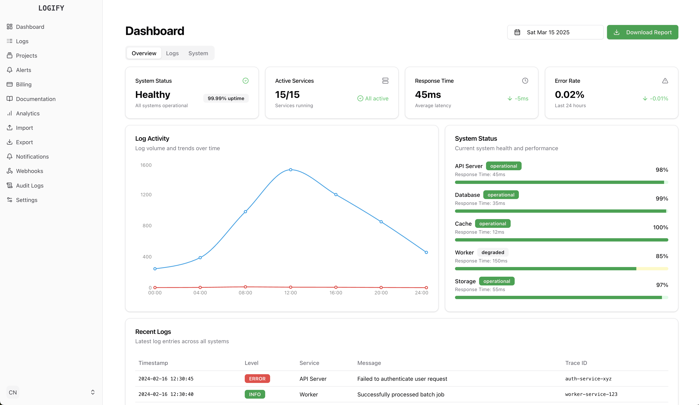
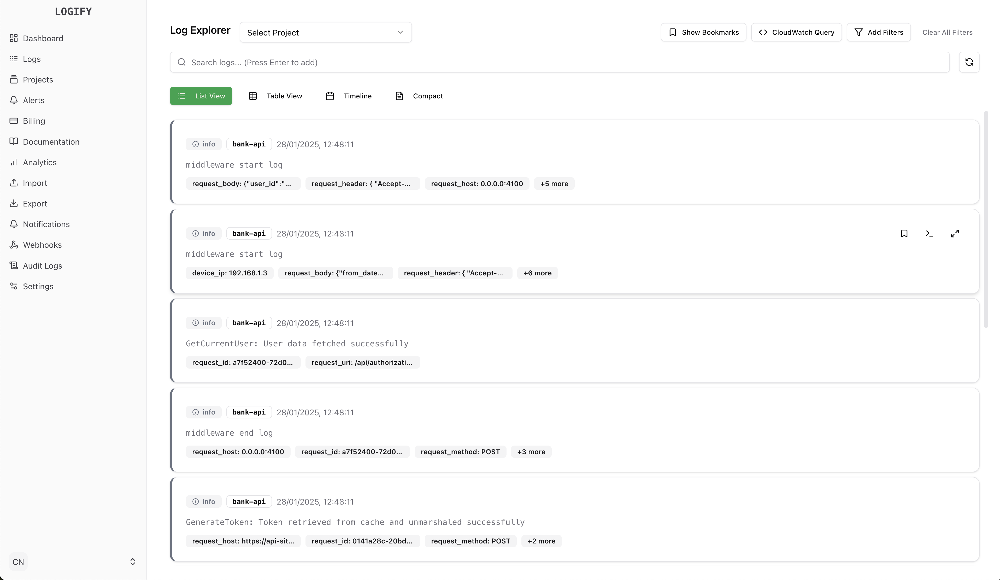
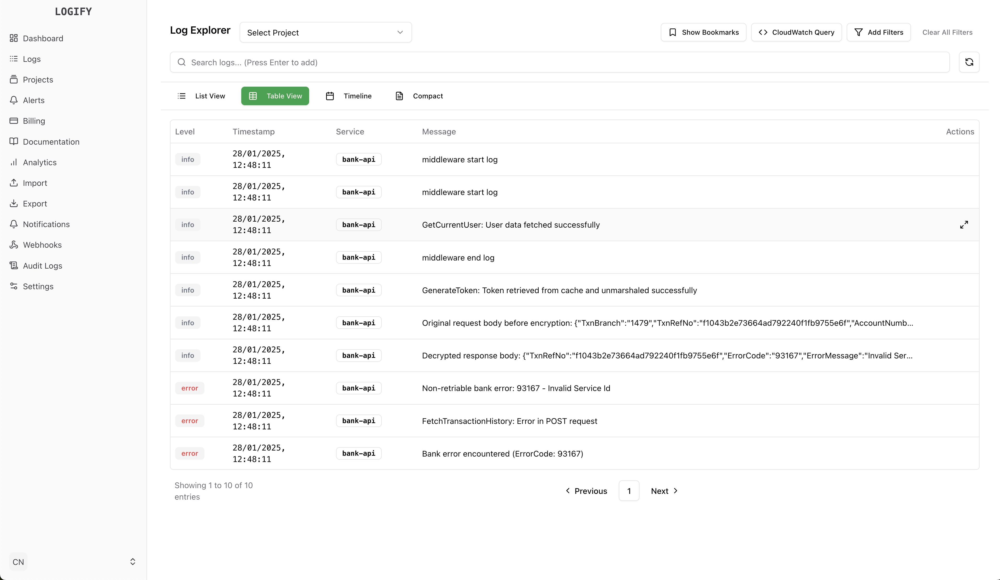
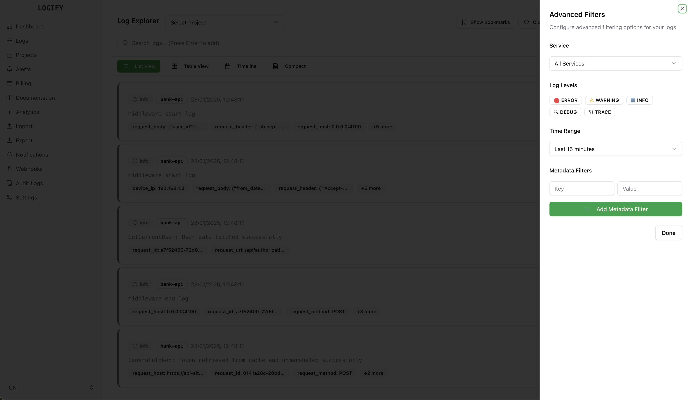
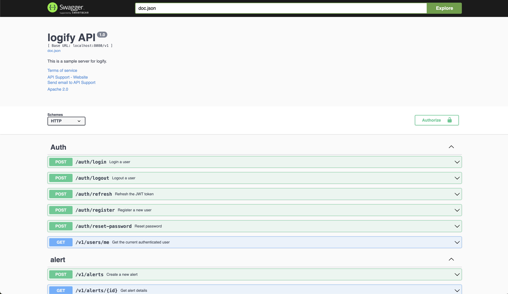
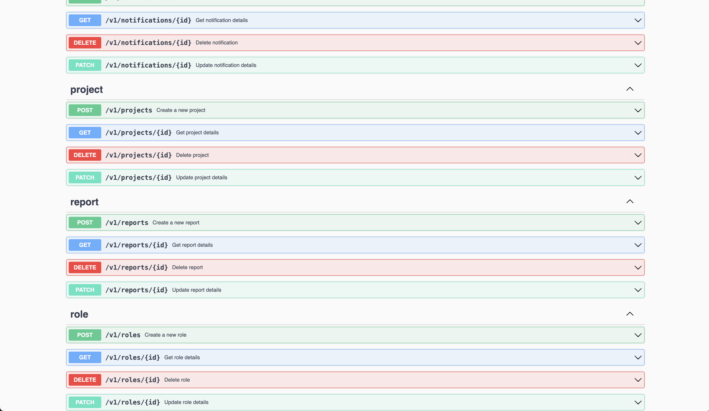

# logify

## Description
<no value>

## Table of Contents
- [Installation](#installation)
- [Usage](#usage)
- [API Documentation](#api-documentation)
- [Configuration](#configuration)
- [Screenshots](#screenshots)
- [Contributing](#contributing)
- [License](#license)

## Installation
[Provide installation instructions here]

## Usage
[Provide usage instructions or examples here]

## API Documentation
[Link to or provide brief overview of API documentation]

## Configuration
[Explain any configuration settings or environment variables]

## Screenshots

### Dashboard

### Logs Dashboard

### Table View Dashboard

### Analytics

### Filter Logs

### API Documentation

## Contributing
[Provide guidelines for contributing to the project]

## License
This project is licensed under the MIT - see the [LICENSE.md](LICENSE.md) file for details.
