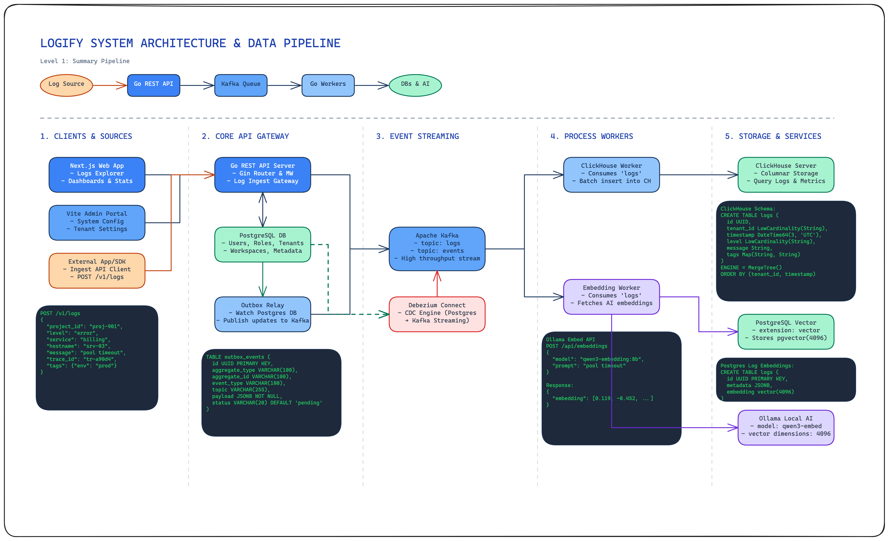

# Logify

Logify is a self-hostable log management platform: applications and hosts ship
structured logs to an ingest API, which streams them through Kafka into
ClickHouse for fast search and analytics, with a web UI for exploring them.



## How it works

```
 apps & hosts                backend (:8080)          pipeline                storage
┌───────────────┐   POST    ┌──────────────┐  Kafka  ┌──────────────────┐   ┌────────────┐
│ Go / Python / │ ───────▶  │  /v1/logs    │ ──────▶ │ clickhouse-worker│ ▶ │ ClickHouse │
│ Node SDKs     │  /v1/logs │  ingest      │  topic  └──────────────────┘   │  (logs)    │
│ logify-agent  │           │              │                                └────────────┘
└───────────────┘           │  auth/search │ ── Postgres (users, projects) ── Redis (cache)
                            └──────────────┘
                                   ▲
                              web UI (:3000)
```

1. **Produce** — an SDK (in your app) or **logify-agent** (on a host) sends each
   log as JSON to `POST /v1/logs`.
2. **Ingest** — the Go backend validates the record and publishes it to the
   Kafka `logs` topic.
3. **Store** — `clickhouse-worker` consumes the topic and writes to ClickHouse.
4. **Explore** — the web UI and search API query ClickHouse; Postgres holds
   users/projects/auth and Redis provides caching.

## Repository layout

```
logify/
├── apps/
│   ├── backend/   Go (Gin) API — ingest, auth, search, projects
│   ├── web/       Web UI (Next.js)
│   ├── agent/     logify-agent — host log shipper (file/stdin/journald)
│   └── admin/     admin tooling
├── sdks/
│   ├── go/        Go SDK
│   ├── python/    Python SDK
│   └── node/      Node SDK
├── packages/      shared types and UI components
├── deployments/   docker, k8s, monitoring
├── infra/         Terraform
└── docker-compose.yaml
```

## Quick start (local stack)

Requires Docker.

```bash
# 1. Start infrastructure (Postgres, Redis, Kafka, ClickHouse, MinIO)
docker compose up -d

# 2. Create the Kafka ingest topic
make create-topic

# 3. Start the app services (backend + web)
docker compose --profile app up -d

# Optional dev tools (kafka-ui, etc.)
docker compose --profile dev up -d
```

Backend API: <http://localhost:8080> · Web UI: <http://localhost:3000>

## Sending logs

**From a host** — the agent tails files / journald / stdin and ships them
([apps/agent](./apps/agent)):

```bash
cd apps/agent && CGO_ENABLED=0 go build -o logify-agent .
myapp 2>&1 | ./logify-agent run --url http://localhost:8080 --service myapp
```

**From an application** — use an SDK ([sdks/](./sdks)):

```go
client, _ := logify.New(logify.WithBaseURL("http://localhost:8080"), logify.WithService("checkout"))
client.Info(ctx, "order placed", logify.WithEntryMetadataValue("order_id", "A-42"))
```

All paths POST the same JSON shape to `POST /v1/logs`.

## Tech stack

| Layer | Technology |
| --- | --- |
| Backend API | Go, Gin |
| Log storage | ClickHouse |
| Ingest pipeline | Kafka |
| Metadata / auth | PostgreSQL, JWT |
| Cache | Redis |
| Object storage | MinIO (S3-compatible) |
| Web UI | Next.js |
| Agent & SDKs | Go (static binary), Python, Node |

See each component's own README for details:
[backend](./apps/backend) · [agent](./apps/agent) · [SDKs](./sdks).
