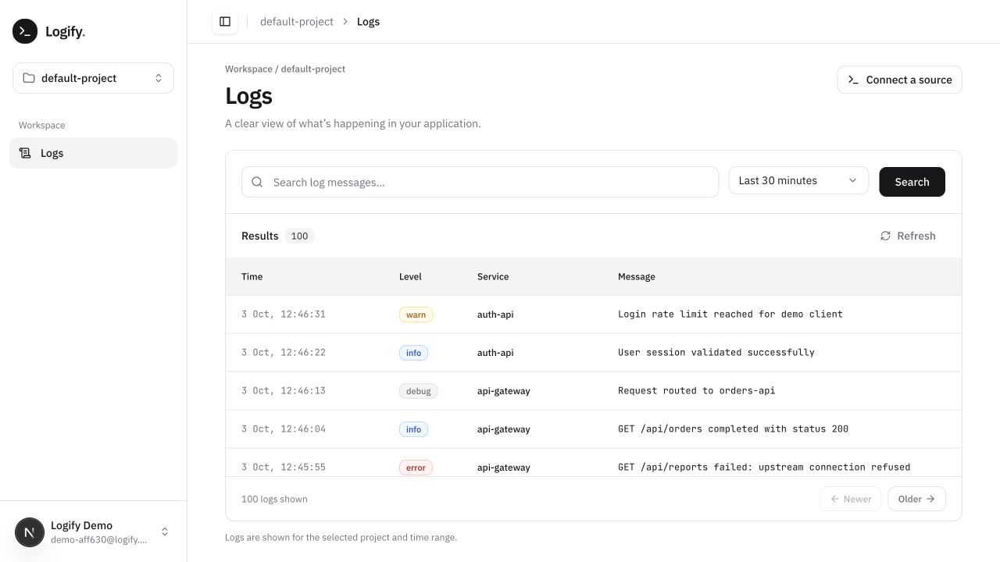
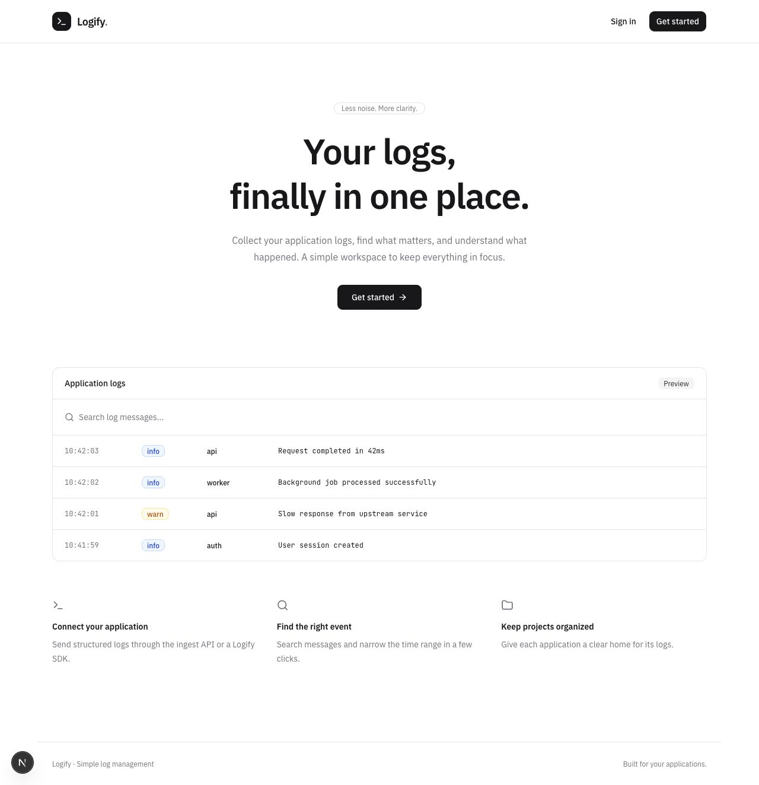
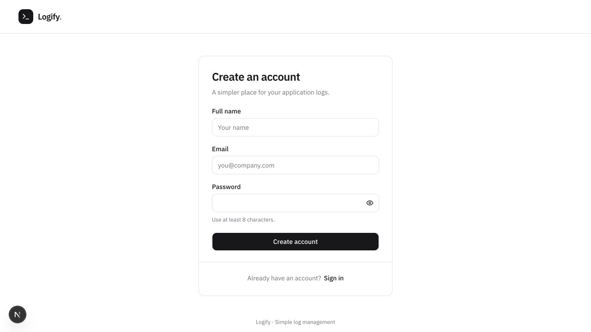
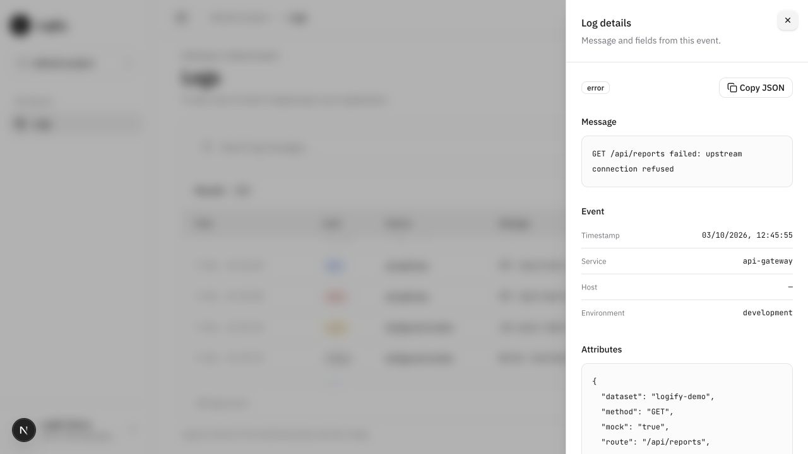
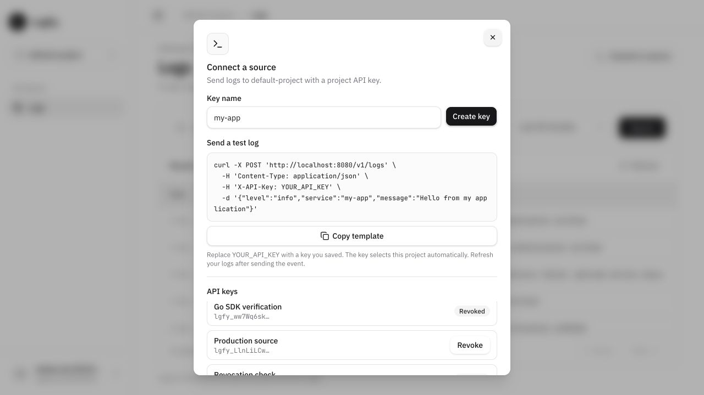
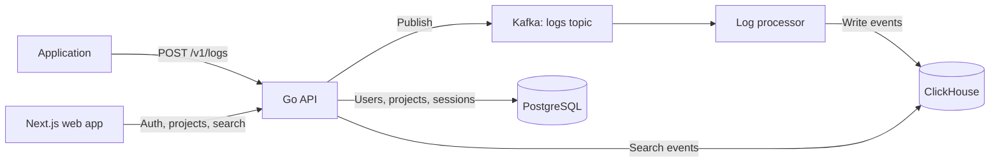

# Logify

A self-hosted workspace for your application logs. Send structured events to the
Go API, store them in ClickHouse through Kafka, and search them in a simple,
white-theme interface built with Next.js and shadcn/ui.

[Quick start](#quick-start) · [Screenshots](#screenshots) ·
[Sending logs](#sending-logs) · [Architecture](#architecture) ·
[Troubleshooting](#troubleshooting)



## What you can do

- **Collect structured logs** through the authenticated `POST /v1/logs` endpoint.
- **Find events** by message and time range, then page through the results.
- **Inspect a log** in a side panel with its message, service, timestamp,
  environment, and attributes. Copy the complete event as JSON.
- **Organize projects** with a sidebar project switcher and project creation.
  Registration creates `default-project` in the backend automatically.
- **Connect an application** using the workspace's generated curl command.
- **Try the complete pipeline** with the included sample-data script.

The log table scrolls independently, keeping the sidebar, search controls,
column headings, and pagination in view.

## Quick start

### Requirements

| Tool | Used for |
| --- | --- |
| Docker with Compose v2 | PostgreSQL, Kafka, ClickHouse, Redis, and the log processor |
| Go 1.26.2 or newer compatible toolchain | Running the backend; version declared in `apps/backend/go.mod` |
| Node.js 20.9+ and npm | Running the Next.js web app |
| Python 3.9+ | Optional sample-data script; no additional packages required |

Clone the repository:

```bash
git clone https://github.com/indalyadav56/logify.git
cd logify
```

### 1. Start the backend and log pipeline

Run this from the repository root and leave the terminal open:

```bash
APP_SERVER_PORT=:8081 make -C apps/backend run
```

This starts the development infrastructure, waits for it to become healthy,
applies the PostgreSQL and ClickHouse migrations, starts the log processor in
Docker, and runs the API locally on port `8081`. The API and processor create
the Kafka `logs` topic during startup.

### 2. Start the web app

In another terminal, from the repository root:

```bash
cd apps/web
npm ci
NEXT_PUBLIC_LOGIFY_API_BASE_URL=http://localhost:8081 npm run dev
```

Open [localhost:3000](http://localhost:3000) and create an account. The backend
creates your first project as part of registration, and the UI selects it.

| Local service | Address |
| --- | --- |
| Web app | [localhost:3000](http://localhost:3000) |
| Backend API | [localhost:8081](http://localhost:8081/healthz) |
| API documentation | [localhost:8081/swagger/index.html](http://localhost:8081/swagger/index.html) |
| PostgreSQL | `localhost:5432` |
| Kafka | `localhost:29092` |
| ClickHouse | `localhost:8123` over HTTP; `localhost:9000` native protocol |
| Redis | `localhost:6379` |

### 3. Add sample logs

From the repository root:

```bash
make mock-data
```

Enter your Logify email and password when prompted. The script sends 100
fictional events across six services to your existing default project. Open
**Logs**, choose **Last 30 minutes**, and select **Refresh**.

Useful variations:

```bash
# Preview payloads without signing in or sending requests.
make mock-data ARGS='--dry-run --count 5'

# Generate a larger batch spanning the last hour.
make mock-data ARGS='--count 200 --minutes 60'

# Point the script at another API port.
make mock-data ARGS='--base-url http://localhost:8080'
```

See the [sample-data guide](mock-data/README.md) for access-token authentication,
project selection, and custom fixtures. Each run adds a new batch; events become
searchable after the processor writes them to ClickHouse.

### Stop local services

Stop the API and web processes with `Ctrl+C`, then stop the development
containers from the repository root:

```bash
make -C apps/backend dev-down
```

Named volumes preserve your accounts, projects, and logs.

## Screenshots

These captures use the current interface, a fictional demo account, and events
from [`mock-data/logs.json`](mock-data/logs.json).

<details>
<summary><strong>Landing page</strong> — a short introduction and application-log preview</summary>



</details>

<details>
<summary><strong>Account creation</strong> — a simple registration form</summary>



</details>

<details>
<summary><strong>Log details</strong> — inspect an event without leaving the explorer</summary>



</details>

<details>
<summary><strong>Connect a source</strong> — send your first event using curl</summary>



</details>

## Sending logs

In the web app, select a project and choose **Connect a source**. **Copy command**
adds your current access token to the example. Run the command, then refresh
the explorer.

To construct a request yourself, replace both placeholders below:

```bash
curl -X POST 'http://localhost:8081/v1/logs' \
  -H 'Content-Type: application/json' \
  -H 'Authorization: Bearer YOUR_ACCESS_TOKEN' \
  -d '{
    "project_id": "YOUR_PROJECT_UUID",
    "level": "info",
    "service": "checkout-api",
    "environment": "development",
    "message": "Order created successfully",
    "tags": {"order_id": "DEMO-1042"}
  }'
```

The API responds with `202 Accepted` after Kafka acknowledges the event:

```json
{"message":"log received"}
```

Additional fields include `timestamp` (RFC 3339), `hostname`, `source`,
`trace_id`, `span_id`, `request_id`, and JSON `metadata`. `tags` values are
strings. Use a project returned by your authenticated `GET /v1/projects` request.

Client packages are available in [the Go SDK](sdks/go/README.md) and
[the Python SDK](sdks/python/README.md). The current backend uses Bearer-token
authentication; an `X-API-Key` header alone does not authenticate requests.

## Architecture


```mermaid
flowchart LR
    App[Application] -->|POST /v1/logs| API[Go API]
    Web[Next.js web app] -->|Auth, projects, search| API
    API -->|Publish| Kafka[Kafka: logs topic]
    Kafka --> Processor[Log processor]
    Processor -->|Write events| CH[(ClickHouse)]
    API -->|Search events| CH
    API -->|Users, projects, sessions| PG[(PostgreSQL)]
```

PostgreSQL stores account, project, and authentication data. ClickHouse stores
the log events. Kafka decouples ingestion from storage so accepted events can
be processed asynchronously. Redis is included in the development Compose
configuration.

Registration writes the user, default project, session, and refresh token in
one PostgreSQL transaction. A failed step rolls back signup; signing in again
does not create another default project.

### Technology

| Component | Stack |
| --- | --- |
| Web app | Next.js 16, React 19, TypeScript, Tailwind CSS 4, shadcn/ui |
| API and workers | Go, Gin, pgx, kafka-go |
| Account and project storage | PostgreSQL 18 with pgvector |
| Log storage | ClickHouse |
| Event pipeline | Apache Kafka |
| Local infrastructure | Docker Compose; Alpine-based PostgreSQL, Redis, ClickHouse, and Go runtime images |
| Sample data | Python standard library |

## Configuration

The backend loads `apps/backend/configs/dev.yaml` for `APP_ENV=dev`, then applies
`APP_*` environment overrides. An optional `apps/backend/.env` supplies values
that are not already set in the environment.

| Variable | Purpose |
| --- | --- |
| `APP_SERVER_PORT` | API listen address, such as `:8081`; configuration default is `:8080` |
| `APP_JWT_SECRET` | Token signing secret |
| `APP_POSTGRES_HOST`, `APP_POSTGRES_PORT` | PostgreSQL connection address |
| `APP_POSTGRES_USER`, `APP_POSTGRES_PASSWORD`, `APP_POSTGRES_DATABASE` | PostgreSQL credentials and database |
| `APP_KAFKA_BROKERS` | Kafka broker addresses; local development uses `localhost:29092` |
| `APP_CLICKHOUSE_HOST`, `APP_CLICKHOUSE_PORT` | ClickHouse native connection address |
| `APP_CLICKHOUSE_USER`, `APP_CLICKHOUSE_PASSWORD`, `APP_CLICKHOUSE_DATABASE` | ClickHouse credentials and database |
| `NEXT_PUBLIC_LOGIFY_API_BASE_URL` | API URL reachable by the user's browser |

To persist the web app's API URL, add this to `apps/web/.env.local`:

```dotenv
NEXT_PUBLIC_LOGIFY_API_BASE_URL=http://localhost:8081
```

Restart the web dev server after changing it. `NEXT_PUBLIC_*` values are embedded
at build time for a compiled frontend.

Development defaults are PostgreSQL `postgres` / `postgres`, database `logify`,
and ClickHouse `default` / `mypassword`, database `logify`. Set credentials and
`APP_JWT_SECRET` for your own deployment.

### Build and run the full stack in Docker

From the repository root, build the images and start all services in one command:

```bash
make run
```

This uses `docker-compose.alpine.yaml` to start the web app, API, log processor,
migrator, PostgreSQL, Redis, Kafka, ClickHouse, and Debezium. The web app is at
[localhost:3000](http://localhost:3000), and the API defaults to port `8080`.
`make build` remains an alias for the same command.

Run `make down` from the repository root to stop both the full Docker stack
(`logify-alpine`) and the host-development containers (`logify-dev`). Database
and broker volumes are preserved. Other Docker projects keep running.

### Run only the backend in Docker

To run the API and processor in containers, start the named services from the
Alpine Compose configuration. Their database and broker dependencies start
automatically:

```bash
BACKEND_PORT=8081 docker compose -f docker-compose.alpine.yaml up -d --build backend log-processor
docker compose -f docker-compose.alpine.yaml logs -f backend log-processor
```

Use this API with the web development command above. The Compose project is
`logify-alpine`; the host-development workflow uses `logify-dev` and separate
volumes. Stop an existing API process before publishing the same port.

Compose overrides include `BACKEND_PORT`, `POSTGRES_USER`, `POSTGRES_PASSWORD`,
`POSTGRES_DB`, `CLICKHOUSE_USER`, `CLICKHOUSE_PASSWORD`, `CLICKHOUSE_DB`, and
`APP_JWT_SECRET`. Database credentials must match existing volumes.

Stop both Logify container stacks while preserving data:

```bash
make down
```

## Repository layout

```text
logify/
├── apps/
│   ├── backend/                 Go API, workers, and database migrations
│   └── web/                     Next.js app and shadcn/ui components
├── docker/postgres/             PostgreSQL Alpine image with pgvector
├── docs/screenshots/            Captures used in this README
├── mock-data/                   Event fixtures, seed script, and script tests
├── sdks/                        Go and Python clients; Node package scaffold
├── services/                    Separate service implementations and scaffolding
├── docker-compose.alpine.yaml   Backend, storage, and application service definitions
├── docker-compose.dev.yaml      Loopback ports for host development
├── docker-compose.yaml          Earlier Compose configuration
└── docker-compose.microservices.yaml
```

## Development checks

Run these commands from the repository root:

```bash
# Backend tests and static analysis.
make -C apps/backend test
make -C apps/backend vet

# Web type checking and linting.
cd apps/web
npx tsc --noEmit
npm run lint
```

Sample-data tests run from the repository root:

```bash
python3 -m unittest discover -s mock-data/tests -v
```

The [backend guide](apps/backend/README.md) includes integration tests for
transactional registration and Kafka topic creation.

## Troubleshooting

| Symptom | Check |
| --- | --- |
| PostgreSQL connection refused | Start the development dependencies with `make -C apps/backend dev-up` and confirm Docker is running. |
| The web app cannot reach the API | Check `/healthz`, match `NEXT_PUBLIC_LOGIFY_API_BASE_URL` to `APP_SERVER_PORT`, and restart the web dev server. |
| An API port is already in use | Choose another `APP_SERVER_PORT` and update the web API URL and sample-data `--base-url` together. |
| Ingest returns `failed to publish log` | Inspect the API and Kafka logs. Startup must reach Kafka and create the `logs` topic successfully. |
| Accepted logs do not appear | Run `make -C apps/backend dev-logs`; select the correct project and time range, then refresh after processing. |

Useful checks for the host-development workflow:

```bash
curl http://localhost:8081/healthz
curl http://localhost:8081/readyz
docker compose -f docker-compose.alpine.yaml -f docker-compose.dev.yaml ps
docker compose -f docker-compose.alpine.yaml -f docker-compose.dev.yaml logs --tail=100 kafka log-processor
```

More documentation: [Backend](apps/backend/README.md) ·
[Web app](apps/web/README.md) · [Sample data](mock-data/README.md) ·
[Go SDK](sdks/go/README.md) · [Python SDK](sdks/python/README.md).
