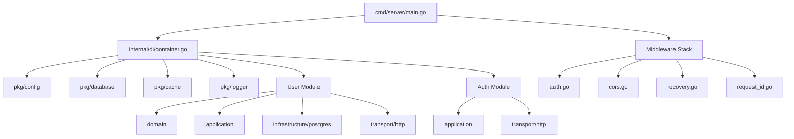

# Logify Backend — Implementation Walkthrough

## Summary

Implemented the full Logify Go backend, transforming empty scaffolding into a working REST API server. **25+ files** created/modified across all clean architecture layers.

## Architecture



## Files Created/Modified

### Foundation

| File                                                                               | Description                                                               |
| ---------------------------------------------------------------------------------- | ------------------------------------------------------------------------- |
| [config.go](file:///home/indal/workspace/logify/apps/backend/pkg/config/config.go) | Env-based config for all services (DB, Redis, ES, ClickHouse, Kafka, JWT) |
| [main.go](file:///home/indal/workspace/logify/apps/backend/cmd/server/main.go)     | Entry point with graceful shutdown                                        |

### Infrastructure Connectors

| File                                                                                             | Description                                   |
| ------------------------------------------------------------------------------------------------ | --------------------------------------------- |
| [postgres.go](file:///home/indal/workspace/logify/apps/backend/pkg/database/postgres.go)         | GORM PostgreSQL connection with pool settings |
| [redis.go](file:///home/indal/workspace/logify/apps/backend/pkg/cache/redis.go)                  | go-redis client initialization                |
| [elasticsearch.go](file:///home/indal/workspace/logify/apps/backend/pkg/search/elasticsearch.go) | Elasticsearch v8 client setup                 |
| [clickhouse.go](file:///home/indal/workspace/logify/apps/backend/pkg/analytics/clickhouse.go)    | ClickHouse connection via clickhouse-go       |
| [kafka.go](file:///home/indal/workspace/logify/apps/backend/pkg/messaging/kafka.go)              | Kafka producer/consumer wrappers              |

### Shared Utilities

| File                                                                                        | Description                                                |
| ------------------------------------------------------------------------------------------- | ---------------------------------------------------------- |
| [response.go](file:///home/indal/workspace/logify/apps/backend/pkg/response/response.go)    | Standard API response envelope (Success, Error, Paginated) |
| [logger.go](file:///home/indal/workspace/logify/apps/backend/pkg/logger/logger.go)          | Structured logging via uber-go/zap                         |
| [validator.go](file:///home/indal/workspace/logify/apps/backend/pkg/validator/validator.go) | Request validation with human-readable errors              |

### Middleware

| File                                                                                           | Description                             |
| ---------------------------------------------------------------------------------------------- | --------------------------------------- |
| [auth.go](file:///home/indal/workspace/logify/apps/backend/pkg/middleware/auth.go)             | JWT Bearer token validation             |
| [cors.go](file:///home/indal/workspace/logify/apps/backend/pkg/middleware/cors.go)             | CORS configuration                      |
| [recovery.go](file:///home/indal/workspace/logify/apps/backend/pkg/middleware/recovery.go)     | Panic recovery with stack trace logging |
| [request_id.go](file:///home/indal/workspace/logify/apps/backend/pkg/middleware/request_id.go) | UUID request ID injection               |

### User Module (Clean Architecture)

| File                                                                                                                            | Layer     | Description                                 |
| ------------------------------------------------------------------------------------------------------------------------------- | --------- | ------------------------------------------- |
| [user.go](file:///home/indal/workspace/logify/apps/backend/internal/user/domain/user.go)                                        | Domain    | Entity with UUID, roles, domain errors      |
| [repository.go](file:///home/indal/workspace/logify/apps/backend/internal/user/domain/repository.go)                            | Domain    | Repository interface with CRUD + pagination |
| [user_repository.go](file:///home/indal/workspace/logify/apps/backend/internal/user/infrastructure/postgres/user_repository.go) | Infra     | GORM implementation with filtering/sorting  |
| [user_service.go](file:///home/indal/workspace/logify/apps/backend/internal/user/application/user_service.go)                   | App       | Service with bcrypt hashing, DTOs           |
| [handler.go](file:///home/indal/workspace/logify/apps/backend/internal/user/transport/http/handler.go)                          | Transport | Gin handlers for all CRUD operations        |
| [routes.go](file:///home/indal/workspace/logify/apps/backend/internal/user/transport/http/routes.go)                            | Transport | JWT-protected route registration            |

### Auth Module

| File                                                                                                          | Description                            |
| ------------------------------------------------------------------------------------------------------------- | -------------------------------------- |
| [auth_service.go](file:///home/indal/workspace/logify/apps/backend/internal/auth/application/auth_service.go) | Login, Register, RefreshToken with JWT |
| [handler.go](file:///home/indal/workspace/logify/apps/backend/internal/auth/transport/http/handler.go)        | Auth HTTP handlers                     |
| [routes.go](file:///home/indal/workspace/logify/apps/backend/internal/auth/transport/http/routes.go)          | Public auth routes                     |

### DI & DevOps

| File                                                                                      | Description                                     |
| ----------------------------------------------------------------------------------------- | ----------------------------------------------- |
| [container.go](file:///home/indal/workspace/logify/apps/backend/internal/di/container.go) | Dependency injection with graceful shutdown     |
| [Dockerfile](file:///home/indal/workspace/logify/apps/backend/Dockerfile)                 | Multi-stage build (golang → alpine)             |
| [Makefile](file:///home/indal/workspace/logify/apps/backend/Makefile)                     | run, build, test, lint, docker, migrate targets |

### Migrations

| File                                                                                                                                 | Description                       |
| ------------------------------------------------------------------------------------------------------------------------------------ | --------------------------------- |
| [000001_create_users_table.up.sql](file:///home/indal/workspace/logify/apps/backend/migrations/000001_create_users_table.up.sql)     | Users table with UUID PK, indexes |
| [000001_create_users_table.down.sql](file:///home/indal/workspace/logify/apps/backend/migrations/000001_create_users_table.down.sql) | Drop users table                  |

## API Endpoints

| Method   | Path                    | Auth | Description            |
| -------- | ----------------------- | ---- | ---------------------- |
| `GET`    | `/health`               | No   | Health check           |
| `POST`   | `/api/v1/auth/register` | No   | Register new user      |
| `POST`   | `/api/v1/auth/login`    | No   | Login, get tokens      |
| `POST`   | `/api/v1/auth/refresh`  | No   | Refresh access token   |
| `GET`    | `/api/v1/users/me`      | Yes  | Get current user       |
| `GET`    | `/api/v1/users`         | Yes  | List users (paginated) |
| `GET`    | `/api/v1/users/:id`     | Yes  | Get user by ID         |
| `POST`   | `/api/v1/users`         | Yes  | Create user            |
| `PUT`    | `/api/v1/users/:id`     | Yes  | Update user            |
| `DELETE` | `/api/v1/users/:id`     | Yes  | Delete user            |

## Verification

- ✅ `go build ./...` — compiles with zero errors
- ✅ `go vet ./...` — static analysis clean
- ✅ `go mod tidy` — all dependencies resolved

## How to Run

```bash
cd apps/backend
make run          # Development mode
make build        # Production binary
make docker-build # Docker image
```
