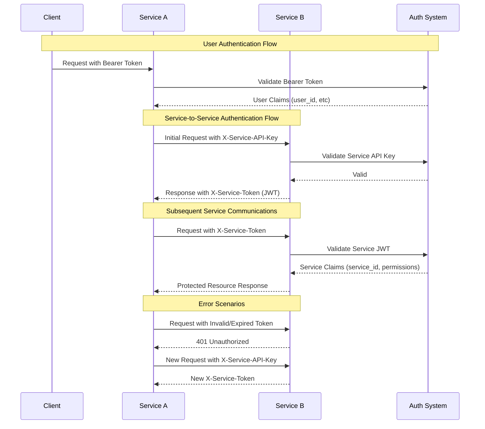

# Microservice Authentication Documentation

## Overview

This document outlines the authentication mechanisms used for both user requests and service-to-service communication in our microservices architecture.

## Table of Contents

- [Authentication Types](#authentication-types)
- [Service Authentication Flow](#service-authentication-flow)
- [API Key Management](#api-key-management)
- [Security Considerations](#security-considerations)
- [Implementation Guide](#implementation-guide)
- [Troubleshooting](#troubleshooting)

## Authentication Types

### 1. User Authentication

- **Method**: Bearer Token
- **Header**: `Authorization: Bearer <jwt_token>`
- **Usage**: For end-user requests
- **Claims**: Contains `user_id` and user-specific permissions

### 2. Service Authentication

#### Initial Authentication

- **Method**: API Key
- **Header**: `X-Service-API-Key: <api_key>`
- **Usage**: First request between services

#### Subsequent Requests

- **Method**: JWT Token
- **Header**: `X-Service-Token: <jwt_token>`
- **Usage**: All following requests
- **Expiration**: 1 hour (configurable)

## Service Authentication Flow

### Initial Request

1. Service A includes its API key in the request header

```http
GET /api/resource
X-Service-API-Key: pk_service_a_key_xxxxx
```

2. Service B validates the API key and returns a JWT

```http
200 OK
X-Service-Token: eyJhbGciOiJIUzI1NiIs...
```

### Subsequent Requests

1. Service A includes the JWT in the request header

```http
GET /api/resource
X-Service-Token: eyJhbGciOiJIUzI1NiIs...
```

2. Service B validates the JWT and processes the request

## API Key Management

### API Key Format

- Prefix: `pk_` (for identification)
- Service Identifier: `service_name`
- Random String: At least 32 characters
- Example: `pk_payment_service_xxxxx`

### Environment Variables

```bash
# Service A
SERVICE_A_API_KEY=pk_service_a_key_xxxxx

# Service B
SERVICE_B_API_KEY=pk_service_b_key_xxxxx
```

### Service Configuration Example

```go
var RegisteredServices = map[string]ServiceConfig{
    "payment-service": {
        ServiceID:   "payment-service",
        APIKey:      os.Getenv("PAYMENT_SERVICE_API_KEY"),
        Permissions: []string{"transaction.read", "transaction.write"},
    }
}
```

## Security Considerations

### API Key Security

- Never log API keys
- Rotate keys periodically
- Use secure key storage (e.g., HashiCorp Vault)
- Different keys for different environments

### JWT Security

- Short expiration time (1 hour recommended)
- Include service identifier and permissions
- Sign with strong secret
- Validate on every request

### Best Practices

1. Use HTTPS for all communications
2. Implement rate limiting
3. Monitor failed authentication attempts
4. Log security events
5. Regular key rotation
6. Implement circuit breakers

## Implementation Guide

### 1. Setting Up Middleware

```go
// Service authentication middleware
func ServiceAuthMiddleware(logger logger.Logger, jwt jwt.JWT) gin.HandlerFunc {
    return func(c *gin.Context) {
        apiKey := c.GetHeader("X-Service-API-Key")
        // ... validation logic
    }
}

// JWT validation middleware
func ServiceTokenMiddleware(logger logger.Logger, jwt jwt.JWT) gin.HandlerFunc {
    return func(c *gin.Context) {
        token := c.GetHeader("X-Service-Token")
        // ... JWT validation logic
    }
}
```

### 2. Route Configuration

```go
func SetupRoutes(r *gin.Engine, logger logger.Logger, jwt jwt.JWT) {
    // Service authentication
    serviceAuth := r.Group("/api/v1/service/auth")
    serviceAuth.Use(ServiceAuthMiddleware(logger, jwt))

    // Protected service routes
    serviceRoutes := r.Group("/api/v1/service")
    serviceRoutes.Use(ServiceTokenMiddleware(logger, jwt))
}
```

## Troubleshooting

### Common Issues

1. **401 Unauthorized**

   - Check API key validity
   - Verify JWT expiration
   - Confirm service permissions

2. **Missing Token**

   - Ensure initial authentication completed
   - Check header names
   - Verify token storage

3. **Invalid Token**
   - Check token expiration
   - Verify signing key
   - Confirm service identity

### Logging Examples

```go
// Error logging
logger.Error(fmt.Sprintf(
    "Service authentication failed: %v | Service: %s | IP: %s",
    err,
    serviceID,
    c.ClientIP(),
))

// Audit logging
logger.Info(fmt.Sprintf(
    "Service authenticated successfully | Service: %s | IP: %s",
    serviceID,
    c.ClientIP(),
))
```

### Monitoring Recommendations

1. Track metrics:

   - Authentication success/failure rates
   - Token expiration events
   - API key usage patterns

2. Set up alerts for:
   - Multiple authentication failures
   - Unusual traffic patterns
   - API key expiration

## Support

For issues or questions:

1. Check logs for specific error messages
2. Review service configuration
3. Verify environment variables
4. Contact security team for API key issues


